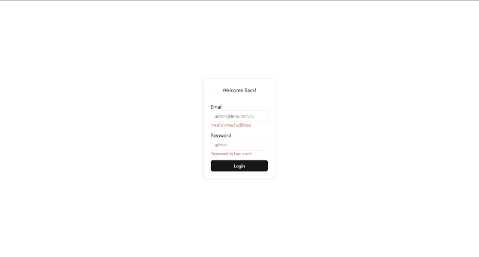

# 📋 Админ-панель пользователей

Простая и удобная админ-панель для управления пользователями: просмотр, редактирование, создание и удаление записей. Построена с использованием современного стека React-инструментов.

---

## 🎥 Демонстрация

<div align="center">
  
</div>

## 🚀 Основные возможности

- ✅ **Страница входа** — защищённый доступ к админке  
- 👥 **Таблица пользователей** — отображение всех пользователей в удобном виде  
- ✏️ **Редактирование** — клик по строке → форма редактирования с возможностью изменить любые поля  
- ➕ **Создание нового пользователя** — отдельная форма с валидацией  
- 🗑️ **Удаление пользователя** — безопасное удаление через кнопку в форме редактирования  
- 🔐 **Выход из профиля** — кнопка в хедере для завершения сессии  
- 🛡️ **Валидация форм** — с помощью `Zod` и `react-hook-form`  
- 📡 **Управление состоянием запросов** — через `React Query`  
- 🎨 **UI-компоненты** — на основе `shadcn/ui` (стилизованные, доступные, адаптивные)

---

## 🧰 Технологии

- **React 18** + **TypeScript**
- **React Router DOM** — навигация
- **React Query** (`@tanstack/react-query`) — управление данными и загрузками
- **react-hook-form** + **Zod** — валидация и управление формами
- **shadcn/ui** — компоненты: `Button`, `Card`, `Input`, `Table`, `Popover`, `Calendar`, `Select`, `Checkbox`
- **Tailwind CSS** — стилизация
- **Lucide React** — иконки
- **FSD** — удобная архитектура

---

В вашем `README.md` есть несколько ошибок и дублирований в разделе **«Установка и запуск»**. Вот исправленная и логически выстроенная версия:

---

## 📦 Установка и запуск

> ⚠️ Проект состоит из **двух частей**:  
> - **Клиент** (React-админка) — этот репозиторий  
> - **Сервер** (бэкенд API) — отдельный репозиторий

### 1. Клонируйте клиент (админ-панель)
```bash
git clone https://github.com/walledoll/forms.git
cd forms
```

### 2. Установите зависимости клиента
```bash
npm install
# или
pnpm install
```

### 3. Запустите dev-сервер клиента
```bash
npm run dev
```

> 🌐 Админка будет доступна по адресу: [http://localhost:5173](http://localhost:5173)

---

### 4. Запустите бэкенд-сервер (обязательно!)

Клиент **требует работающий сервер API**.  
Склонируйте и запустите отдельный репозиторий бэкенда (замените URL на реальный):

```bash
# В новой вкладке терминала
git clone https://github.com/walledoll/forms-server.git
cd forms-server
npm install
npm run start
```

> 📡 Убедитесь, что сервер запущен на ожидаемом порту (например, `http://localhost:3000`).  
---


